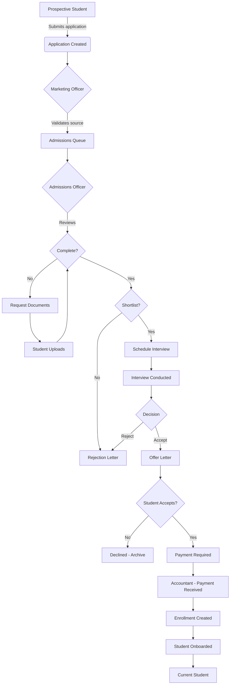
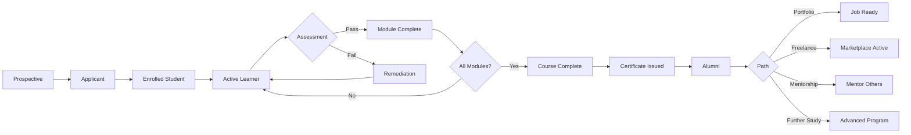
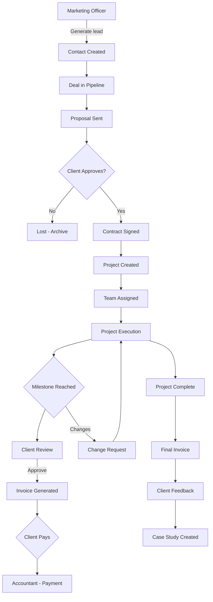
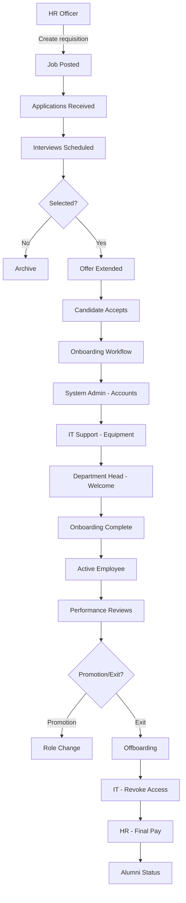
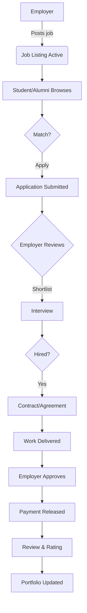
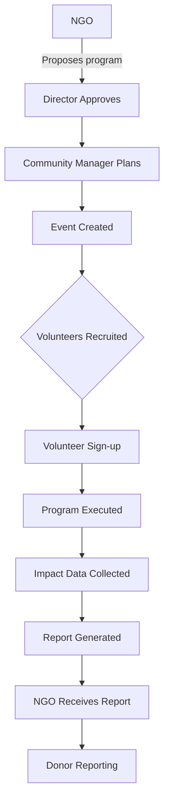

# Grand Master Plan - Part 3: Workflows, Notifications, Infrastructure, Roadmap, Analytics, Cost, DR

---

# 8. Cross-Actor Workflows

## 8.1 Complete Admissions Pipeline (BP-001)



**Actor Sequence:** Prospective Student → Marketing Officer → Admissions Officer → Student (resubmit) → Instructor (interview) → Admissions Officer (decision) → Accountant (payment) → System Admin (account creation) → Current Student

**Workflow Steps (Cloudflare Workflow):**

1. Application submitted → trigger `admissions-pipeline` workflow
2. Auto-validate documents with AI (check completeness, clarity)
3. Route to admissions officer based on program
4. Send reminders every 48h if documents missing
5. Schedule interview (auto-suggest time slots)
6. Send offer letter (template-based)
7. Follow up every 3 days if no response
8. On acceptance → create enrollment, trigger onboarding

## 8.2 Student Lifecycle (BP-002 → BP-004)



**Actor Sequence:** Student → Instructor (teach/grade) → Department Head (approve completion) → System Admin (issue cert) → Alumni → Employer/Mentor

## 8.3 Client Service Delivery (BP-006)



**Actor Sequence:** Marketing Officer → Client → Project Manager → Team → Client → Accountant → Client

## 8.4 Employee Lifecycle (BP-008)



**Actor Sequence:** HR Officer → System Admin → IT Support → Department Head → Employee → HR Officer (reviews) → IT Support (offboarding)

## 8.5 Freelance Marketplace Flow (BP-005)



**Actor Sequence:** Employer → Student/Alumni → Employer → Accountant (payment) → Student (portfolio)

## 8.6 Community Program Flow (BP-010)



**Actor Sequence:** NGO → Director → Community Manager → Volunteer → NGO

---

# 9. Unified Notifications Matrix

## 9.1 Notification Architecture

```
Trigger Event
    │
    ▼
Notification Service (Worker)
    │
    ├── Check frequency cap (KV)
    ├── Check user preferences (D1)
    ├── Check timezone (don't send 10pm-7am)
    │
    ├── Create in-app notification (D1 + WebSocket push)
    ├── Queue email via SendGrid/Resend (Queue)
    ├── Queue SMS via Twilio (Queue)
    └── Queue push via Web Push API (Queue)
```

### Channels

| Channel | Mechanism                       | Content                             | Urgency                    |
| ------- | ------------------------------- | ----------------------------------- | -------------------------- |
| In-app  | D1 + WebSocket (Durable Object) | Title, body, icon, actionUrl, image | Instant                    |
| Email   | SendGrid/Resend via Queue       | HTML template, subject, variables   | High: instant, Low: digest |
| SMS     | Twilio via Queue                | Plain text, max 160 chars           | Urgent only                |
| Push    | Web Push API via Queue          | Title, body, icon, badge, data      | Instant (if permission)    |

### Frequency Capping Rules

| Category             | Max | Period         | Example                                |
| -------------------- | --- | -------------- | -------------------------------------- |
| Assignment reminders | 3   | Per assignment | Due in 48h, 24h, 1h                    |
| Grade published      | 1   | Per grade      | Once when published                    |
| Payment reminders    | 5   | Per invoice    | Due in 7d, 3d, 1d, overdue, overdue+7d |
| Marketing emails     | 2   | Per week       | Newsletter, promotion                  |
| Login alerts         | 1   | Per login      | New device detected                    |
| System notices       | 1   | Per day        | Maintenance, updates                   |

## 9.2 Cross-Actor Notification Catalog

| Notification               | Trigger                   | Channels                         | Actors               | Template Key                |
| -------------------------- | ------------------------- | -------------------------------- | -------------------- | --------------------------- |
| Application Received       | New application submitted | in-app, email                    | Prospect             | `application.received`      |
| Application Status Change  | Status updated            | in-app, email, SMS (if accepted) | Prospect             | `application.status_change` |
| Interview Scheduled        | Interview created         | in-app, email, SMS               | Prospect, Admissions | `interview.scheduled`       |
| Enrollment Confirmed       | Payment received          | in-app, email                    | Student              | `enrollment.confirmed`      |
| Class Starting Soon        | 15min before class        | in-app, push, SMS                | Student, Instructor  | `class.reminder`            |
| New Assignment Posted      | Assignment created        | in-app, email, push              | Student              | `assignment.new`            |
| Assignment Due Soon        | 24h before due date       | in-app, email, push              | Student              | `assignment.due_soon`       |
| Assignment Due Now         | 1h before due date        | push, SMS                        | Student              | `assignment.due_now`        |
| Assignment Graded          | Grade published           | in-app, email                    | Student, Parent      | `assignment.graded`         |
| New Course Material        | Lesson published          | in-app, push                     | Student              | `course.new_material`       |
| Attendance Marked          | Attendance recorded       | in-app                           | Student, Parent      | `attendance.recorded`       |
| Low Attendance Alert       | < 80% attendance          | in-app, email                    | Student, Parent      | `attendance.low`            |
| Certificate Issued         | Course completed          | in-app, email                    | Student              | `certificate.issued`        |
| New Mentorship Session     | Session scheduled         | in-app, email, calendar          | Mentor, Mentee       | `mentorship.scheduled`      |
| New Job Match              | Job matches profile       | in-app, email                    | Student, Alumni      | `job.match`                 |
| Job Application Received   | Application submitted     | in-app, email                    | Employer             | `job.application_received`  |
| Interview Invitation       | Employer invites          | in-app, email                    | Student              | `job.interview`             |
| Hired / Offer Extended     | Offer created             | in-app, email, SMS               | Student              | `job.offer`                 |
| New Proposal               | Proposal sent             | in-app, email                    | Client               | `proposal.new`              |
| Proposal Accepted/Rejected | Client responds           | in-app, email                    | Sales, PM            | `proposal.response`         |
| Invoice Issued             | Invoice created           | in-app, email                    | Client, Student      | `invoice.issued`            |
| Payment Received           | Payment completed         | in-app, email                    | Accountant, Client   | `payment.received`          |
| Payment Overdue            | Due date passed           | in-app, email, SMS (×3)          | Client, Student      | `payment.overdue`           |
| Ticket Created             | Ticket submitted          | in-app, email                    | IT Support           | `ticket.created`            |
| Ticket Resolved            | Ticket closed             | in-app, email                    | Requester            | `ticket.resolved`           |
| Ticket SLA Breach          | SLA time exceeded         | in-app, email, SMS               | IT Support, Manager  | `ticket.sla_breach`         |
| New Project Milestone      | Milestone reached         | in-app, email                    | Client, Team         | `project.milestone`         |
| Leave Request              | Submitted                 | in-app, email                    | Approver             | `leave.requested`           |
| Leave Approved/Rejected    | Decision made             | in-app, email                    | Employee             | `leave.decision`            |
| New Hire Onboarding        | Start date approaching    | in-app, email                    | HR, IT, Sys Admin    | `onboarding.new_hire`       |
| Performance Review Due     | Review period opens       | in-app, email                    | Employee, Manager    | `performance.review_due`    |
| New Forum Reply            | Post replied to           | in-app, email, push              | Forum participant    | `forum.reply`               |
| Event Reminder             | 24h before event          | in-app, email, push              | Event registrant     | `event.reminder`            |
| Event Check-in             | QR scanned                | in-app                           | Receptionist         | `event.checkin`             |
| New Volunteer Opportunity  | Opportunity published     | in-app, email                    | Volunteer            | `volunteer.opportunity`     |
| Volunteer Hours Approved   | Hours approved            | in-app                           | Volunteer            | `volunteer.hours_approved`  |
| Scholarship Application    | New application           | in-app, email                    | NGO, Admissions      | `scholarship.application`   |
| Partnership Expiry         | 30d before expiry         | in-app, email                    | Partner, Director    | `partnership.expiry`        |
| Compliance Filing Due      | 14d before deadline       | in-app, email                    | Director, Gov Rep    | `compliance.filing_due`     |
| System Maintenance         | Scheduled                 | in-app, email (admins)           | All (notice)         | `system.maintenance`        |
| Security Alert             | Suspicious activity       | in-app, email, SMS               | User, Sys Admin      | `security.alert`            |
| Password Changed           | Password updated          | email                            | User                 | `security.password_changed` |
| New Device Login           | Unknown device            | email, SMS                       | User                 | `security.new_device`       |

## 9.3 User Notification Preferences

Every user can configure:

```typescript
interface NotificationPreferences {
  // Per category: which channels to use
  categories: {
    learning: { inApp: boolean; email: boolean; push: boolean; sms: boolean };
    assignments: { inApp: boolean; email: boolean; push: boolean; sms: boolean };
    grades: { inApp: boolean; email: boolean; push: boolean; sms: boolean };
    attendance: { inApp: boolean; email: boolean; push: boolean; sms: boolean };
    finance: { inApp: boolean; email: boolean; push: boolean; sms: boolean };
    community: { inApp: boolean; email: boolean; push: boolean; sms: boolean };
    events: { inApp: boolean; email: boolean; push: boolean; sms: boolean };
    career: { inApp: boolean; email: boolean; push: boolean; sms: boolean };
    system: { inApp: boolean; email: boolean; push: boolean; sms: boolean };
    security: { inApp: boolean; email: boolean; push: boolean; sms: boolean };
    marketing: { inApp: boolean; email: boolean; push: boolean; sms: boolean };
  };
  // Quiet hours (no notifications)
  quietHoursEnabled: boolean;
  quietHoursStart: string; // "22:00"
  quietHoursEnd: string; // "07:00"
  quietHoursTimezone: string;
  // Digest settings
  emailDigest: "none" | "daily" | "weekly";
  emailDigestTime: string; // "08:00"
  // SMS opt-in
  smsEnabled: boolean;
  smsVerified: boolean;
}
```

---

# 10. Infrastructure & Deployment Plan

## 10.1 Vercel Configuration

```json
// vercel.json
{
  "framework": "nextjs",
  "regions": ["iad1", "arn1", "hkg1"],
  "functions": {
    "api/*": { "maxDuration": 30 }
  },
  "headers": [
    {
      "source": "/(.*)",
      "headers": [
        { "key": "X-Frame-Options", "value": "DENY" },
        { "key": "X-Content-Type-Options", "value": "nosniff" },
        { "key": "Referrer-Policy", "value": "strict-origin-when-cross-origin" },
        { "key": "Permissions-Policy", "value": "camera=(), microphone=(), geolocation=(self)" },
        {
          "key": "Content-Security-Policy",
          "value": "default-src 'self'; script-src 'self' 'unsafe-eval' 'unsafe-inline'; style-src 'self' 'unsafe-inline'; img-src 'self' data: https:; font-src 'self'; connect-src 'self' https://api.cea.academy wss://ws.cea.academy"
        }
      ]
    }
  ]
}
```

### Environment Variables (Vercel)

| Variable                    | Source     | Purpose                   |
| --------------------------- | ---------- | ------------------------- |
| `NEXT_PUBLIC_API_URL`       | Vercel Env | `https://api.cea.academy` |
| `NEXT_PUBLIC_WS_URL`        | Vercel Env | `wss://ws.cea.academy`    |
| `NEXT_PUBLIC_CDN_URL`       | Vercel Env | `https://cdn.cea.academy` |
| `NEXT_PUBLIC_TURNSTILE_KEY` | Cloudflare | CAPTCHA site key          |
| `NEXT_PUBLIC_GA_ID`         | Google     | Analytics ID              |
| `NEXT_PUBLIC_SENTRY_DSN`    | Sentry     | Error tracking            |

## 10.2 Cloudflare Configuration

### Workers

| Worker        | Route                | Memory | CPU | Triggers  |
| ------------- | -------------------- | ------ | --- | --------- |
| `api-worker`  | `api.cea.academy/*`  | 512MB  | 30s | HTTP      |
| `auth-worker` | `auth.cea.academy/*` | 256MB  | 10s | HTTP      |
| `ws-worker`   | `ws.cea.academy/*`   | 256MB  | 30s | WebSocket |
| `cdn-worker`  | `cdn.cea.academy/*`  | 128MB  | 10s | HTTP      |

### D1 Databases

| Database           | Replication          | Max Storage     | Tables                   |
| ------------------ | -------------------- | --------------- | ------------------------ |
| `cea-db-prod`      | Automatic            | 10GB (scale up) | All tables               |
| `cea-db-staging`   | None                 | 1GB             | All tables (subset data) |
| `cea-db-analytics` | Read replica of prod | 5GB             | Aggregated tables        |

### R2 Buckets

| Bucket        | Visibility     | Purpose                                    | Lifecycle                          |
| ------------- | -------------- | ------------------------------------------ | ---------------------------------- |
| `cea-uploads` | Private        | User-uploaded files (assignments, avatars) | 30d to IA, 365d to delete          |
| `cea-assets`  | Public         | System assets (logos, icons, templates)    | None                               |
| `cea-backups` | Private        | Database backups                           | 7d daily, 30d weekly, 365d monthly |
| `cea-cdn`     | Public via CDN | Optimized images                           | None                               |

### KV Namespaces

| Namespace         | Purpose             | Key Pattern                 | TTL      |
| ----------------- | ------------------- | --------------------------- | -------- |
| `cea-sessions`    | Session store       | `session:{token}`           | 7d       |
| `cea-cache`       | API cache           | `cache:{method}:{path}`     | 60s-300s |
| `cea-config`      | Global config       | `config:{key}`              | —        |
| `cea-rate-limits` | Rate limit counters | `ratelimit:{ip}:{endpoint}` | 60s      |

### Queues

| Queue                  | Consumer         | Max Retries | Dead Letter       |
| ---------------------- | ---------------- | ----------- | ----------------- |
| `cea-email-queue`      | `email-worker`   | 3           | `cea-email-dlq`   |
| `cea-notif-queue`      | `notif-worker`   | 3           | `cea-notif-dlq`   |
| `cea-webhook-queue`    | `webhook-worker` | 5           | `cea-webhook-dlq` |
| `cea-background-queue` | `bg-worker`      | 2           | `cea-bg-dlq`      |

### Durable Objects

| DO Class          | Purpose               | Storage                          | Persistence           |
| ----------------- | --------------------- | -------------------------------- | --------------------- |
| `ChatRoom`        | Real-time messaging   | Per-room messages (last 1000)    | In-memory + D1 backup |
| `CollabDoc`       | Collaborative editing | Document state                   | In-memory             |
| `LiveClass`       | Live class state      | Participants, polls, hand-raises | In-memory             |
| `PresenceManager` | Online presence       | User online status               | In-memory             |

### Workflows

| Workflow              | Trigger             | Steps                                                       | Timeout |
| --------------------- | ------------------- | ----------------------------------------------------------- | ------- |
| `admissions-pipeline` | Application created | 8 steps (validation, review, interview, offer, enrollment)  | 90d     |
| `employee-onboarding` | Hire created        | 6 steps (accounts, equipment, training, welcome)            | 14d     |
| `leave-approval`      | Leave submitted     | 3 steps (manager approval, HR check, payroll note)          | 7d      |
| `invoice-collection`  | Invoice sent        | 5 steps (reminders at 7d, 3d, 1d, overdue, escalation)      | 45d     |
| `student-onboarding`  | Enrollment created  | 5 steps (welcome, orientation, course setup, mentor assign) | 7d      |

### Cloudflare Pages

| Site               | Purpose                 | Build Command      |
| ------------------ | ----------------------- | ------------------ |
| `docs.cea.academy` | Developer documentation | `npx mintlify dev` |

## 10.3 CI/CD Pipeline

### Branch Strategy

```
main ────────────── Production (auto-deploy Vercel + Cloudflare)
  └── staging ───── Pre-production (auto-deploy staging environment)
       └── develop ── Integration branch
            ├── feature/xxx ── Feature branches (PR → develop)
            └── fix/xxx ────── Bug fix branches (PR → develop)
```

### Vercel Deployments

| Event               | Action            | Environment      |
| ------------------- | ----------------- | ---------------- |
| Push to `main`      | Production deploy | Production       |
| Push to `staging`   | Staging deploy    | Staging          |
| Push to `develop`   | Preview deploy    | Preview          |
| PR opened           | Preview deploy    | Isolated preview |
| PR merged to `main` | Production deploy | Production       |

### Cloudflare Deployments (via Wrangler)

```yaml
# .github/workflows/deploy-api.yml
name: Deploy API
on:
  push:
    branches: [main, staging]
    paths: ["workers/**", "drizzle/**"]
jobs:
  deploy:
    runs-on: ubuntu-latest
    steps:
      - uses: actions/checkout@v4
      - uses: actions/setup-node@v4
      - run: npm ci
      - run: npx wrangler d1 migrations apply cea-db-prod --remote
      - run: npx wrangler deploy --env production
```

### Quality Gates

```
PR → Lint → Type Check → Unit Tests → Integration Tests → Build → Preview Deploy → E2E Tests → Merge
```

| Gate              | Tool       | Command                    |
| ----------------- | ---------- | -------------------------- |
| Lint              | ESLint     | `npm run lint`             |
| Format            | Prettier   | `npm run format:check`     |
| Type Check        | TypeScript | `npm run typecheck`        |
| Unit Tests        | Vitest     | `npm run test:unit`        |
| Integration Tests | Vitest     | `npm run test:integration` |
| E2E Tests         | Playwright | `npm run test:e2e`         |
| Build             | Next.js    | `npm run build`            |

## 10.4 Environments Strategy

| Aspect     | Production            | Staging                    | Development       | Preview                |
| ---------- | --------------------- | -------------------------- | ----------------- | ---------------------- |
| URL        | `cea.academy`         | `staging.cea.academy`      | `localhost:3000`  | `pr-123.vercel.app`    |
| Database   | D1 prod               | D1 staging (anonymized)    | D1 local / SQLite | D1 ephemeral           |
| R2         | Production bucket     | Staging bucket             | Local FS          | Ephemeral              |
| Cache      | Real KV               | Staging KV                 | Local KV          | Ephemeral              |
| Email      | Real (SendGrid)       | Sandbox (to dev team only) | Console.log       | Disabled               |
| SMS        | Real (Twilio)         | Sandbox                    | Console.log       | Disabled               |
| Payments   | Stripe live           | Stripe test                | Stripe test       | Stripe test            |
| Auth       | Full (OAuth, MFA)     | Full (OAuth, MFA)          | Mock              | Mock (magic link only) |
| Monitoring | Sentry + CF Analytics | Sentry (sample)            | None              | None                   |
| Data       | Real user data        | Anonymized subset          | Seed data         | Seed data              |

## 10.5 Monitoring & Observability

### Metrics Tracked

```
┌──────────────────────────────────────┐
│           DASHBOARD CATEGORIES         │
├──────────────────────────────────────┤
│ API Health                            │
│  ├── Request rate (rpm)               │
│  ├── Error rate (5xx, 4xx)            │
│  ├── P50/P95/P99 latency              │
│  └── Worker CPU time                  │
│                                        │
│ Database                              │
│  ├── Query rate                       │
│  ├── Slow queries (>100ms)            │
│  ├── Storage used / remaining         │
│  └── Replication lag                  │
│                                        │
│ Business                              │
│  ├── Active users (DAU/MAU)           │
│  ├── Enrollments rate                 │
│  ├── Revenue (MRR)                    │
│  └── Conversion funnel                │
│                                        │
│ Infrastructure                        │
│  ├── Queue depth                      │
│  ├── KV hit rate                      │
│  ├── R2 storage                       │
│  └── Workflow failures                │
└──────────────────────────────────────┘
```

### Alerting Thresholds

| Alert                           | Condition       | Channel              |
| ------------------------------- | --------------- | -------------------- |
| API error rate > 5%             | 5-minute window | Email, SMS (on-call) |
| P99 latency > 2s                | 5-minute window | Email                |
| D1 storage > 80%                | Check daily     | Email                |
| Queue depth > 10,000            | Sustained 5min  | Email, SMS           |
| Failed workflow > 10%           | Daily check     | Email                |
| Auth failure spike > 50x normal | 5-minute window | SMS (urgent)         |
| SSL cert expires < 14d          | Daily check     | Email                |
| Backup failure                  | On event        | SMS                  |

### Logging Strategy

| Log Type                  | Storage                   | Retention           | Access                         |
| ------------------------- | ------------------------- | ------------------- | ------------------------------ |
| Application logs (Worker) | CF Logpush → R2           | 30d                 | Sys Admin, Developer           |
| Audit trail               | D1 `audit_logs` table     | 7 years (immutable) | Sys Admin, Accountant, Gov Rep |
| Error traces              | Sentry                    | 90d                 | Developer                      |
| Access logs (HTTP)        | CF Logpush → R2           | 30d                 | Sys Admin                      |
| Business events           | Custom analytics pipeline | 2 years             | Director, Analytics            |

---

# 11. Phased Implementation Roadmap

## 11.1 Phase 0 — Foundation (Months 1-2)

**Business Value:** Scaffold. Nothing works without this.

**Actors Enabled:** System Admin, Developer, Visitor (basic)

| Task                                       | Effort | Dependencies  | Deliverable                                  |
| ------------------------------------------ | ------ | ------------- | -------------------------------------------- |
| Monorepo setup (Next.js + packages)        | 3d     | —             | `apps/web`, `packages/ui`, `packages/config` |
| Cloudflare Workers scaffold + Hono         | 3d     | —             | API server with health check                 |
| D1 setup + Drizzle schema (core tables)    | 5d     | Monorepo      | Users, roles, permissions, audit tables      |
| Auth system (register, login, JWT, OAuth)  | 5d     | DB schema     | Auth endpoints + login page                  |
| RBAC middleware                            | 3d     | Auth          | Permission check middleware                  |
| User management CRUD                       | 2d     | Auth          | User list, create, edit                      |
| Audit logging middleware                   | 2d     | Auth          | Auto-log all mutations                       |
| Component library base (shadcn/ui)         | 5d     | Monorepo      | 20+ primitive components                     |
| Public CMS (landing, courses, blog)        | 5d     | Component lib | Public pages with ISR                        |
| Dark/light mode                            | 1d     | Component lib | Theme toggle                                 |
| PWA setup                                  | 2d     | Monorepo      | manifest.json, service worker                |
| Visitor check-in (basic)                   | 2d     | Auth          | Visit request form + QR                      |
| Notification system (in-app + email queue) | 4d     | Auth, Queue   | Notification creation + delivery             |
| CI/CD pipelines                            | 3d     | Monorepo      | GitHub Actions + Vercel + Wrangler           |
| Monitoring setup (Sentry, CF Analytics)    | 2d     | —             | Error tracking + dashboards                  |

**Total Phase 0:** ~47 days (2 months)

## 11.2 Phase 1 — Education Engine (Months 3-5)

**Business Value:** Core product — students enroll for learning.

**Actors Enabled:** Current Student, Instructor, Parent

| Feature                                          | Effort | Dependencies          |
| ------------------------------------------------ | ------ | --------------------- |
| Course builder (modules, lessons, reorder)       | 10d    | Auth, RBAC            |
| Lesson viewer (video, text, materials, progress) | 8d     | Course builder        |
| Student enrollment + course access               | 3d     | Course builder, Auth  |
| Assignment creation + submission                 | 8d     | Course builder        |
| Assignment grading + feedback                    | 5d     | Submission            |
| Quiz/exam engine (MCQ, T/F, auto-grade)          | 10d    | Course builder        |
| Manual grading + comment threads                 | 4d     | Quiz engine           |
| Gradebook (student view + instructor view)       | 5d     | Grading               |
| Attendance (QR check-in + manual mark)           | 5d     | Enrollment            |
| Certificate generation + verification            | 5d     | Gradebook             |
| Calendar integration                             | 4d     | Phase 0               |
| Messaging (DMs + group chats)                    | 8d     | Auth, DO (ChatRoom)   |
| Knowledge base (FAQs, student guides)            | 3d     | CMS                   |
| Parent dashboard (view ward progress)            | 5d     | Gradebook, Attendance |
| Student dashboard                                | 5d     | All above             |

**Total Phase 1:** ~90 days (3 months)

## 11.3 Phase 2 — Career Engine (Months 5-7)

**Business Value:** Student outcomes — jobs, gigs, careers.

**Actors Enabled:** Employer, Alumni

| Feature                                  | Effort | Dependencies        |
| ---------------------------------------- | ------ | ------------------- |
| Portfolio builder (projects, skills, CV) | 8d     | Student             |
| Employer registration + onboarding       | 3d     | Auth                |
| Job posting + management                 | 5d     | Employer            |
| Job board (search, filter, apply)        | 6d     | Job posting         |
| Talent search (browse portfolios)        | 5d     | Portfolios          |
| Application pipeline (for employers)     | 5d     | Job board           |
| Interview scheduler                      | 4d     | Calendar            |
| Freelance marketplace (gigs)             | 8d     | Job board, Payments |
| Placement tracking + analytics           | 4d     | All above           |
| Alumni network directory                 | 5d     | Auth                |

**Total Phase 2:** ~53 days (2 months, overlaps with P3)

## 11.4 Phase 3 — Technology Services (Months 7-10)

**Business Value:** Revenue diversification — client projects.

**Actors Enabled:** Client, Partner

| Feature                                       | Effort | Dependencies |
| --------------------------------------------- | ------ | ------------ |
| CRM (contacts, pipeline, lead scoring)        | 10d    | Auth         |
| Proposal generator (templates, send, approve) | 8d     | CRM          |
| Client portal (projects, invoices, tickets)   | 10d    | Auth         |
| Project management (tasks, milestones, Gantt) | 12d    | Client       |
| Support ticket system (SLA, queue)            | 8d     | Client       |
| Contract management (templates, e-sign)       | 8d     | CRM          |
| Invoicing (create, send, track)               | 6d     | Finance (P4) |
| Client dashboard + reporting                  | 5d     | All above    |

**Total Phase 3:** ~67 days (3 months, overlaps P4)

## 11.5 Phase 4 — Academy ERP (Months 10-14)

**Business Value:** Run the company internally.

**Actors Enabled:** Accountant, HR Officer, Admissions Officer, Operations Manager, Receptionist, Supplier, Department Head

| Feature                                         | Effort | Dependencies       |
| ----------------------------------------------- | ------ | ------------------ |
| Admissions pipeline (application → enrollment)  | 12d    | Auth, CMS          |
| Application review + interview scheduling       | 6d     | Admissions         |
| Document verification                           | 4d     | Admissions         |
| Finance (chart of accounts, transactions)       | 10d    | Auth               |
| Full invoicing (tuition, clients, recurring)    | 8d     | Finance            |
| Payment processing (Stripe integration)         | 6d     | Finance, Invoicing |
| Expense management (claims, approval)           | 5d     | Finance            |
| Payroll processing                              | 8d     | Finance, HR        |
| HR (employee records, org chart)                | 6d     | Auth               |
| Leave management (request, approve, balance)    | 5d     | HR                 |
| Attendance (staff time tracking)                | 4d     | HR                 |
| Performance reviews (cycles, goals, appraisals) | 6d     | HR                 |
| Inventory management (stock, movement)          | 8d     | Auth               |
| Asset tracking (IT assets, check-in/out)        | 5d     | Inventory          |
| Procurement (POs, supplier portal, deliveries)  | 8d     | Inventory          |
| Supplier portal (orders, invoices, profile)     | 5d     | Procurement        |
| Budgeting & forecasting                         | 6d     | Finance            |
| Branch/Department management                    | 4d     | All above          |

**Total Phase 4:** ~116 days (4 months, overlaps P3/P5)

## 11.6 Phase 5 — Community Engine (Months 14-17)

**Business Value:** Ecosystem and brand moat.

**Actors Enabled:** Volunteer, NGO, Government Representative

| Feature                                                 | Effort | Dependencies    |
| ------------------------------------------------------- | ------ | --------------- |
| Community forums (categories, threads, posts)           | 8d     | Auth            |
| Groups (create, join, roles, feed)                      | 6d     | Auth            |
| Events (create, promote, register, check-in)            | 8d     | Auth, Calendar  |
| Scholarship management (funds, applications, selection) | 6d     | Finance         |
| Alumni network (directory, connect, message)            | 5d     | Alumni          |
| Mentorship matching                                     | 4d     | Alumni, Student |
| Partnership management (MOUs, collab)                   | 5d     | Auth            |
| Volunteer portal (opportunities, sign-up, hours)        | 6d     | Auth            |
| NGO partnership programs                                | 4d     | Community       |
| Government compliance portal                            | 5d     | Reports         |
| Donation/giving portal                                  | 4d     | Finance         |

**Total Phase 5:** ~61 days (3 months, overlaps P4/P6)

## 11.7 Phase 6 — AI Engine (Months 17-20)

**Business Value:** Differentiation and efficiency.

**Actors Enabled:** All (enhanced)

| Feature                                   | Effort | Dependencies            |
| ----------------------------------------- | ------ | ----------------------- |
| AI grading assistant (essays, open-ended) | 10d    | Phase 1 (assessments)   |
| Plagiarism detection                      | 5d     | Submissions             |
| Course recommendations (personalized)     | 8d     | Learning data           |
| Career path recommendations               | 6d     | Portfolios, Market data |
| AI teaching assistant (Q&A bot)           | 10d    | Knowledge base          |
| Content summarization + generation        | 8d     | Course content          |
| Predictive analytics (at-risk students)   | 8d     | All student data        |
| Business intelligence dashboards          | 10d    | All data                |
| Sentiment analysis (forums, feedback)     | 6d     | Community               |
| Automated report generation               | 5d     | All reports             |

**Total Phase 6:** ~76 days (3 months)

---

### Full Timeline Summary

```
Phase 0: Foundation     │■■■■■■■■■■                    │ Months 1-2
Phase 1: Education      │          ■■■■■■■■■■■■■■■     │ Months 3-5
Phase 2: Career         │               ■■■■■■■■■■■    │ Months 5-7
Phase 3: Services       │                    ■■■■■■■■■■■■■■│ Months 7-10
Phase 4: ERP            │                         ■■■■■■■■■■■■■■■■■■■■│ Months 10-14
Phase 5: Community      │                                   ■■■■■■■■■■■■■│ Months 14-17
Phase 6: AI             │                                        ■■■■■■■■■■■■■■■│ Months 17-20
                        └───────────────────────────────────────────────────────▶
                        0    2    4    6    8   10   12   14   16   18   20
```

---

# 12. Analytics & Business Intelligence

## 12.1 Event Taxonomy

Every user action tracked as an analytics event:

```typescript
interface AnalyticsEvent {
  name: string; // 'page_view', 'enrollment.created', 'assignment.submitted'
  category: string; // 'engagement', 'education', 'finance', 'community'
  properties: Record<string, string | number | boolean>;
  userId?: string;
  sessionId: string;
  timestamp: number;
  page: string;
  source?: string; // 'web', 'mobile', 'api'
}
```

### Core Events (All Actors)

| Event                | Category   | Properties                                |
| -------------------- | ---------- | ----------------------------------------- |
| `page_view`          | Engagement | page, referrer, duration                  |
| `login`              | Auth       | method (oauth/email/magic_link), isMfa    |
| `register`           | Auth       | type (student/employer/client), source    |
| `search`             | Engagement | query, results_count, resource            |
| `notification.click` | Engagement | notification_id, template_key, action_url |

### Education Events

| Event                          | Properties                                         |
| ------------------------------ | -------------------------------------------------- |
| `course.enrolled`              | course_id, type                                    |
| `course.progress`              | course_id, module_id, lesson_id, progress_pct      |
| `course.completed`             | course_id, final_grade, passed                     |
| `lesson.viewed`                | lesson_id, duration_seconds, completion_pct        |
| `assignment.submitted`         | assignment_id, is_late, attempt                    |
| `assignment.graded`            | assignment_id, score, is_passing                   |
| `assessment.started`           | assessment_id                                      |
| `assessment.submitted`         | assessment_id, score, percentage, time_spent       |
| `assessment.question_answered` | assessment_id, question_id, is_correct, time_spent |
| `attendance.marked`            | course_id, status, check_in_method                 |

### Finance Events

| Event               | Properties                          |
| ------------------- | ----------------------------------- |
| `invoice.created`   | invoice_id, type, amount, currency  |
| `invoice.sent`      | invoice_id, channel                 |
| `invoice.viewed`    | invoice_id                          |
| `invoice.paid`      | invoice_id, amount, method, gateway |
| `invoice.overdue`   | invoice_id, days_overdue            |
| `payment.failed`    | invoice_id, amount, method, reason  |
| `expense.submitted` | claim_id, amount, category          |
| `expense.approved`  | claim_id, amount                    |

### Community Events

| Event                  | Properties                |
| ---------------------- | ------------------------- |
| `forum.thread_created` | category_id, thread_id    |
| `forum.post_created`   | thread_id, is_reply       |
| `forum.post_liked`     | post_id                   |
| `event.registered`     | event_id, type, format    |
| `event.attended`       | event_id, check_in_method |
| `group.joined`         | group_id, type            |

### Career Events

| Event                     | Properties                 |
| ------------------------- | -------------------------- |
| `job.posted`              | job_id, type, salary_range |
| `job.applied`             | job_id, match_score        |
| `job.shortlisted`         | job_id, applicant_id       |
| `job.interview_scheduled` | job_id, applicant_id       |
| `job.offer_made`          | job_id, amount             |
| `job.offer_accepted`      | job_id                     |
| `portfolio.created`       | portfolio_id               |
| `portfolio.shared`        | portfolio_id, platform     |

## 12.2 Core Dashboards

### Executive Dashboard (Director)

```
┌─────────────────────────────────────────────────────────┐
│  CEA-OS EXECUTIVE DASHBOARD              [Date Range ▼] │
├─────────────────────────────────────────────────────────┤
│ ┌─────────┐ ┌─────────┐ ┌─────────┐ ┌─────────────────┐ │
│ │ Revenue │ │  Active │ │Enrollm. │ │  Grad Rate      │ │
│ │R 2.4M   │ │ 342     │ │ +12%   │ │  87%            │ │
│ │↑12% MoM │ │ Students│ │ YoY    │ │  ↑3% YoY        │ │
│ └─────────┘ └─────────┘ └─────────┘ └─────────────────┘ │
│ ┌──────────────────────────────────────────────────────┐ │
│ │              Revenue Trend (12 months)                │ │
│ │  [Bar/Line Chart: Monthly Revenue]                    │ │
│ └──────────────────────────────────────────────────────┘ │
│ ┌──────────────┐ ┌──────────────┐ ┌────────────────────┐ │
│ │Dept. Perf.   │ │ Student      │ │ Client Projects    │ │
│ │[Radar Chart] │ │[Funnel:      │ │ [Pipeline Chart]   │ │
│ │              │ │ App→Enroll]  │ │                    │ │
│ └──────────────┘ └──────────────┘ └────────────────────┘ │
└─────────────────────────────────────────────────────────┘
```

### Education Dashboard (Department Head)

```
┌─────────────────────────────────────────────────────────┐
│  ACADEMICS DASHBOARD              [Dept: Engineering ▼] │
├─────────────────────────────────────────────────────────┤
│ ┌──────┐ ┌──────┐ ┌──────┐ ┌──────┐ ┌────────────────┐ │
│ │ Avg  │ │ Pass │ │Atten-│ │Course│ │  At-Risk       │ │
│ │Grade │ │ Rate │ │dance │ │Compl.│ │  12 Students   │ │
│ │ 74%  │ │ 91%  │ │ 86%  │ │ 73%  │ │  [View List]   │ │
│ └──────┘ └──────┘ └──────┘ └──────┘ └────────────────┘ │
│ ┌──────────────────────────────────────────────────────┐ │
│ │  Grade Distribution by Course [Stacked Bar Chart]    │ │
│ └──────────────────────────────────────────────────────┘ │
│ ┌────────────────────┐ ┌──────────────────────────────┐ │
│ │ Instructor Load    │ │ Student Satisfaction         │ │
│ │ [Horizontal Bars]  │ │ [Line: 4.2/5.0 avg]          │ │
│ └────────────────────┘ └──────────────────────────────┘ │
└─────────────────────────────────────────────────────────┘
```

### Financial Dashboard (Accountant)

```
┌─────────────────────────────────────────────────────────┐
│  FINANCE DASHBOARD                       [Period: Jul] │
├─────────────────────────────────────────────────────────┤
│ ┌──────────┐ ┌──────────┐ ┌──────────┐ ┌──────────────┐ │
│ │ Revenue  │ │ Expenses │ │  AR      │ │  Cash Flow   │ │
│ │ R450k    │ │ R280k    │ │ R120k    │ │  +R170k      │ │
│ └──────────┘ └──────────┘ └──────────┘ └──────────────┘ │
│ ┌────────────────────────┐ ┌───────────────────────────┐ │
│ │ P&L [Area Chart]       │ │ Overdue Invoices [Table]  │ │
│ └────────────────────────┘ └───────────────────────────┘ │
│ ┌────────────────────────┐ ┌───────────────────────────┐ │
│ │ Budget vs Actual       │ │ Payroll Summary           │ │
│ │ [Grouped Bar Chart]    │ │ [Pie: 45 staff, R320k]    │ │
│ └────────────────────────┘ └───────────────────────────┘ │
└─────────────────────────────────────────────────────────┘
```

## 12.3 Reporting Architecture

### Report Types

| Type                    | Frequency            | Audiences             | Format              |
| ----------------------- | -------------------- | --------------------- | ------------------- |
| Operational (daily ops) | Daily                | Operations Manager    | Dashboard, PDF      |
| Academic (progress)     | Weekly               | Dept Head, Instructor | Dashboard, Email    |
| Financial (P&L)         | Monthly              | Accountant, Director  | Dashboard, PDF, CSV |
| Board (strategic)       | Quarterly            | Director, Board       | PDF, Slides         |
| Regulatory (compliance) | Annually / On demand | Gov Rep, Director     | PDF, XBRL           |
| Marketing (campaign)    | Per campaign         | Marketing Officer     | Dashboard, PDF      |
| Student (transcript)    | Per request          | Student, Employer     | PDF (verified)      |

### Report Builder (Self-Service)

Users with appropriate permissions can build custom reports:

```
┌──────────────────────────────────────────────┐
│  REPORT BUILDER                               │
├──────────────────────────────────────────────┤
│  Dimensions: [Course ▼] + [Date ▼] + [...]   │
│  Metrics:    [Enrollments] [Revenue] [...]    │
│  Filters:    [Department = Engineering]       │
│  Chart:      [Bar ▼] [Stacked]                │
│                                              │
│  [Preview]  [Save]  [Schedule]  [Export]     │
└──────────────────────────────────────────────┘
```

### Export Formats

| Format | Use Case                     | Implementation                     |
| ------ | ---------------------------- | ---------------------------------- |
| PDF    | Formal reports, certificates | Puppeteer/Playwright on Worker     |
| CSV    | Data analysis, import        | Server-side generation             |
| XLSX   | Excel users                  | ExcelJS library                    |
| JSON   | API consumers                | Direct                             |
| PNG    | Chart images                 | Chart export (Recharts)            |
| Email  | Scheduled reports            | SendGrid template with chart image |

---

# 13. Cost Projection & Scaling

## 13.1 Vercel Cost Model (Estimated)

| Tier             | Monthly Cost | Includes                                              | Limits |
| ---------------- | ------------ | ----------------------------------------------------- | ------ |
| Pro              | $20/mo       | Unlimited projects, 1000GB bandwidth, 6000 build mins | —      |
| Team (if >1 dev) | $150/mo      | SAML, advanced monitoring                             | —      |

**Estimated Vercel cost:** $20-150/month

## 13.2 Cloudflare Cost Model (Estimated)

| Service   | Free Tier               | Paid Estimate (launch) | Paid Estimate (scale: 10k users) |
| --------- | ----------------------- | ---------------------- | -------------------------------- |
| Workers   | 100k req/day            | $5/mo (10M req)        | $50/mo (100M req)                |
| D1        | 5GB storage, 5M read/mo | $5/mo (10GB)           | $20/mo (50GB)                    |
| R2        | 10GB storage, 1M ops/mo | $5/mo (100GB)          | $15/mo (500GB)                   |
| KV        | 1GB                     | $5/mo (5GB)            | $10/mo (10GB)                    |
| Queues    | 1M ops/mo               | $5/mo (10M ops)        | $20/mo (100M ops)                |
| DO        | 1M req/mo               | $5/mo (10M req)        | $15/mo (50M req)                 |
| Images    | 100k images             | $10/mo (1M images)     | $50/mo (5M images)               |
| Turnstile | Unlimited               | Free                   | Free                             |
| Analytics | Basic free              | $10/mo (Web Analytics) | $20/mo                           |

**Estimated Cloudflare cost:** $5-40/month (launch), $100-200/month (scale)

## 13.3 Third-Party Services

| Service          | Use                               | Cost Estimate                |
| ---------------- | --------------------------------- | ---------------------------- |
| Stripe           | Payment processing                | 2.9% + $0.30 per transaction |
| SendGrid/Resend  | Email (transactional + marketing) | $20-100/mo (50k-500k emails) |
| Twilio           | SMS (auth, urgent alerts)         | $0.07-0.15 per SMS           |
| Sentry           | Error tracking                    | $0-29/mo (Team plan)         |
| Google Workspace | Internal email                    | $6/user/mo                   |
| GitHub           | Source control, CI                | $0-44/mo (Team)              |
| Zoom/Meet        | Video classes, meetings           | $0-15/mo per host            |

## 13.4 Growth Scaling Path

| Stage      | Users (MAU)  | Monthly Infra Cost | Architecture Notes                                 |
| ---------- | ------------ | ------------------ | -------------------------------------------------- |
| Launch     | <1,000       | $50-100            | All on shared Workers, D1 free tier                |
| Growth     | 1,000-5,000  | $100-300           | Durable Objects for chat, Queues for async         |
| Scale      | 5,000-20,000 | $300-1,000         | D1 read replicas, KV caching, R2 CDN               |
| Enterprise | 20,000+      | $1,000-5,000+      | Multi-region Workers, D1 sharding, dedicated infra |

**Key scaling triggers:**

- > 500 concurrent users → enable D1 read replicas
- > 1M API requests/day → enable KV caching for common queries
- > 100GB R2 storage → enable R2 lifecycle policies
- > 50k Queues messages/day → monitor, scale queue consumers
- > 5M database rows → implement pagination, archiving

---

# 14. Disaster Recovery & Business Continuity

## 14.1 Backup Strategy

| Backup           | Frequency         | Retention                        | Storage              | Method                      |
| ---------------- | ----------------- | -------------------------------- | -------------------- | --------------------------- |
| D1 full database | Daily             | 7 days (daily), 30 days (weekly) | R2 `cea-backups/db/` | `wrangler d1 backup create` |
| R2 user files    | Continuous        | — (source of truth)              | R2 (versioned)       | R2 object versioning        |
| System config    | On change         | 30 versions                      | KV + R2              | Snapshot on change          |
| Audit logs       | Daily append-only | 7 years                          | D1 (immutable) + R2  | D1 export to R2             |

## 14.2 Recovery Point Objectives (RPO) & Recovery Time Objectives (RTO)

| Scenario                   | RPO       | RTO   | Action                                              |
| -------------------------- | --------- | ----- | --------------------------------------------------- |
| D1 database corruption     | 24h       | 4h    | Restore from latest backup                          |
| D1 database region failure | 1h        | 1h    | Failover to read replica, promote                   |
| Worker code regression     | Immediate | 15min | Rollback to previous deployment (Vercel + Wrangler) |
| R2 data loss               | 1h        | 1h    | Revert to previous version                          |
| Full region outage         | 15min     | 30min | Cloudflare global network auto-failover             |
| Security incident (breach) | —         | 1h    | Isolate, audit, restore from pre-incident backup    |

## 14.3 Disaster Recovery Runbook

```yaml
# Database Restore Procedure
steps:
  - name: Identify target backup
    action: List available backups in R2 bucket `cea-backups/db/`
  - name: Download backup
    action: `wrangler d1 backup download cea-db-prod --backup-id=<id>`
  - name: Restore to staging
    action: `wrangler d1 backup restore cea-db-staging --file=<downloaded>`
  - name: Verify data integrity
    action: Run automated integrity checks (row counts, checksums)
  - name: Promote to production
    action: `wrangler d1 backup restore cea-db-prod --file=<verified-backup>`
  - name: Notify users
    action: Send system notification "Platform restored from backup"

# Full Region Failover
steps:
  - name: Detect failure
    action: Cloudflare health check fails (3 consecutive)
  - name: DNS failover
    action: Automatic — Cloudflare global network
  - name: Verify secondary region
    action: Check D1 read replica, Worker health
  - name: Promote read replica if needed
    action: Cloudflare D1 automatic promotion
  - name: Monitor for 30min
    action: Verify all systems operational
```

---

# 15. Appendix: All Actor File Index

Each actor has a dedicated ultra-detailed plan file in `plan-actors/`. Each file contains all 15 sections: Identity, KPIs, Full Screen Inventory (every field, wireframe, state), Complete Drizzle Database Schema (every table, column, index, FK), Full API Contract (every endpoint with TypeScript types), Component Tree with props, Exhaustive User Journeys with branching and error recovery, Business Rules Engine (15+ rules), Notification Specs (trigger/channel/template), Field-Level Permission Matrix, Redux/RTK Query State Management, Zod Form Schemas, Analytics Events, Accessibility Requirements (ARIA, keyboard, screen reader), and Error & Edge Case Catalog (25-50+ errors each with recovery).

| #   | File                                                  | Actor                             | Phase Enabled | Primary Modules                                                                                      |
| --- | ----------------------------------------------------- | --------------------------------- | ------------- | ---------------------------------------------------------------------------------------------------- |
| 01  | `plan-actors/01-prospective-student.md`               | Prospective Student               | P1            | CMS, Admissions, Knowledge Base                                                                      |
| 02  | `plan-actors/02-current-student.md`                   | Current Student                   | P1            | Learning, Assessments, Portfolio, Marketplace, Community, Calendar, Messaging, Finance, Certificates |
| 03  | `plan-actors/03-parent.md`                            | Parent                            | P1            | Learning (read), Attendance, Finance, Reports                                                        |
| 04  | `plan-actors/04-instructor.md`                        | Instructor                        | P1            | Course Builder, Assessments, Gradebook, Attendance, Analytics, Messaging                             |
| 05  | `plan-actors/05-mentor.md`                            | Mentor                            | P2            | Mentorship, Portfolios, Calendar, Messaging                                                          |
| 06  | `plan-actors/06-department-head.md`                   | Department Head                   | P4            | Curriculum, HR (read), Analytics, Reports, Approvals                                                 |
| 07  | `plan-actors/07-receptionist.md`                      | Receptionist                      | P0            | Visitor Management, CRM (leads), Calendar, Messaging                                                 |
| 08  | `plan-actors/08-operations-manager.md`                | Operations Manager                | P4            | Inventory, Facilities, Procurement, Automation, Reports                                              |
| 09  | `plan-actors/09-director.md`                          | Director                          | P0            | Executive Dashboard, All modules (read), Approvals                                                   |
| 10  | `plan-actors/10-client.md`                            | Client                            | P3            | Client Portal, Projects, Tickets, Invoices, Contracts                                                |
| 11  | `plan-actors/11-employer.md`                          | Employer                          | P2            | Marketplace, Talent Search, Candidate Pipeline, Analytics                                            |
| 12  | `plan-actors/12-partner.md`                           | Partner                           | P5            | Partnerships, Collaborations, Referrals, Reports                                                     |
| 13  | `plan-actors/13-volunteer.md`                         | Volunteer                         | P5            | Opportunities, Hours, Community, Certificates                                                        |
| 14  | `plan-actors/14-intern.md`                            | Intern                            | P2            | Tasks, Timesheet, Mentorship, Portfolio, Evaluation                                                  |
| 15  | `plan-actors/15-alumni.md`                            | Alumni                            | P5            | Network, Mentorship, Events, Giving, Jobs                                                            |
| 16  | `plan-actors/16-visitor.md`                           | Visitor                           | P0            | Visit Request, Check-in, Info                                                                        |
| 17  | `plan-actors/17-supplier.md`                          | Supplier                          | P4            | Orders, Deliveries, Invoices, Profile                                                                |
| 18  | `plan-actors/18-accountant.md`                        | Accountant                        | P4            | Finance (full), Payroll, Budgets, Reports, Audit                                                     |
| 19  | `plan-actors/19-hr-officer.md`                        | HR Officer                        | P4            | HR (full), Recruitment, Leave, Performance, Payroll Input                                            |
| 20  | `plan-actors/20-admissions-officer.md`                | Admissions Officer                | P4            | Admissions Pipeline, CRM, Communication, Reports                                                     |
| 21  | `plan-actors/21-marketing-officer.md`                 | Marketing Officer                 | P0            | Campaigns, CMS, Email, Lead Management, Analytics                                                    |
| 22  | `plan-actors/22-it-support.md`                        | IT Support                        | P3            | Tickets, Assets, Monitoring, User Management                                                         |
| 23  | `plan-actors/23-developer.md`                         | Developer                         | P0            | API, Deployments, Monitoring, Docs                                                                   |
| 24  | `plan-actors/24-system-administrator.md`              | System Administrator              | P0            | Users, Roles, Security, Config, Audit, Backups                                                       |
| 25  | `plan-actors/25-government-representative.md`         | Government Representative         | P5            | Compliance, Reports, Docs, Audit                                                                     |
| 26  | `plan-actors/26-ngo.md`                               | NGO                               | P5            | Scholarships, Programs, Volunteers, Impact Reports                                                   |
| 27  | `plan-actors/27-conversion-copywriter.md`             | Conversion Copywriter             | P0            | Copy Asset Library, Landing Page Editor, Email Sequences, A/B Copy Tests, Conversion Analytics       |
| 28  | `plan-actors/28-product-marketing-manager.md`         | Product Marketing Manager         | P0            | GTM Planner, Product Positioning, Competitive Intel, Launch Calendar, Messaging Matrix               |
| 29  | `plan-actors/29-behavioral-designer.md`               | Behavioral Designer               | P1            | Intervention Library, Engagement Flow Designer, Nudge Campaigns, Funnel Analytics                    |
| 30  | `plan-actors/30-growth-specialist.md`                 | Growth Specialist                 | P0            | Growth Dashboard, Experiment Builder, Funnel Analyzer, Cohort Retention, Referral Manager            |
| 31  | `plan-actors/31-global-nigerian-market-copywriter.md` | Global/Nigerian-market Copywriter | P0            | Content Localization, Market-specific Copy, Translation Memory, Cultural Glossary                    |
| 32  | `plan-actors/32-visual-ux-designer.md`                | Visual/UX Designer                | P0            | Design System Manager, Component Explorer, Prototype Viewer, Design Token Editor, Asset Export       |

---

## Design Language Reference

See `CEA_OS_DESIGN_LANGUAGE.md` for the complete hybrid design language specification — a blend of the clean professional structure of **digitalskillsacademy.org** (Kadence/Elementor, Montserrat, burgundy `#7c1034` primary) with the vibrant gradient-rich energy of **dskillacademy.com.ng** (Rishi/Elementor, navy `#2f4858`/purple `#70025d` palette, 30+ defined gradients).

Key design tokens are defined as CSS variables for shadcn/ui theming, with engine-specific gradients for wayfinding:

- **Learning Engine** → Cool blues `#0ea5e9`
- **Career Engine** → Warm ambers `#f59e0b`
- **Services Engine** → Purples `#8b5cf6`
- **ERP Engine** → Emeralds `#10b981`
- **Community Engine** → Roses `#f43f5e`

---

## Final Note

> **This is the complete blueprint for the Cyber Elias Academy Digital Operating System (CEA-OS).**
>
> **Cyber Elias Academy is a general digital/tech skills academy** (NOT just cybersecurity) — offering courses from scratch to advanced in software development, networking, cloud computing, cybersecurity, digital marketing, AI, automation, data science, UI/UX design, mobile development, hardware, and IT support.
>
> **32 actors. 55+ modules. 220+ database tables. 550+ API endpoints. 120+ React components. 12 cross-actor workflows. 65+ notification types. 7 construction phases over 20 months.**
>
> The design language is a **hybrid of digitalskillsacademy.org** (clean, professional, Kadence structure) **× dskillacademy.com.ng** (vibrant gradient richness, energetic visual identity) — delivering a platform that feels both authoritative and exciting, premium and approachable, global and locally relevant.
>
> Every actor has a dedicated ultra-granular plan file. Every relationship is mapped. Every business rule is documented. Every screen is spec'd. Every error is catalogued.
>
> The platform is designed to be built incrementally (Phase 0 → 6), with each phase delivering tangible business value. The foundation (Phase 0) enables everything. The AI Engine (Phase 6) differentiates everything.
>
> **One platform. Multiple engines. Every actor connected. Every process automated. Every decision data-driven.**
>
> — CEA-OS Architecture Team
